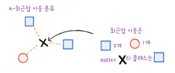
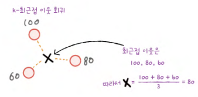
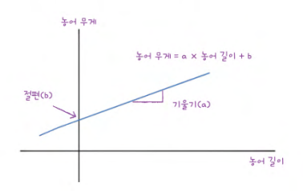
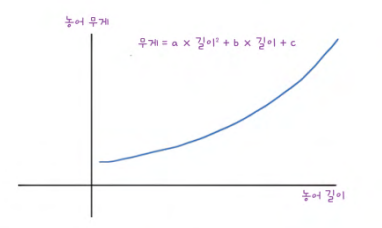

# Chapter 03 회귀 알고리즘과 모델 규제

> **핵심 키워드**: `회귀`, `k-최근접 이웃 회귀`, `결정계수`, `과대적합과 과소적합`

## 03-1 k-최근접 이웃 회귀

- **k-최근접 이웃 분류 알고리즘**

    ```
    예측하려는 샘플에 가장 가까운 샘플 k 개를 선택하고 이 샘플들의 클래스를 확인하여 다수 클래스를 새로운 샘플의 클래스로 예측
    ```
    

- **k-최근접 이웃 회귀 알고리즘**

    ```
    예측하려는 샘플에 가장 가까운 샘플 k 개를 선택하고 이 수치들의 평균을 구해 새로운 샘플의 타깃값을 예측
    ```
    

- **과대적합 vs 과소적합**

    ```
    과대적합(overfitting)

    : 훈련 세트에서 점수가 굉장히 좋았는데 테스트 세트에서는 점수가 굉장히 나쁜 경우

    - 훈련 세트에만 잘 맞는 모델이라 테스트 세트 또는 새로운 샘플에 대한 예측을 만들 때 잘 동작하지 않음

    과소적합(underfitting)

    : 훈련 세트보다 테스트 세트의 점수가 높거나 두 점수가 모두 너무 낮은 경우

    - 모델이 너무 단순하여 훈련 세트에 적절히 훈련되지 않은 경우
    ```

    ```
    과소적합의 해결방법
    : 모델을 조금 더 복잡하게 만들면 됨

    - k-최근접 이웃 알고리즘으로 모델을 더 복잡하게 만드는 방법은 이웃의 개수 k 를 줄이는 것
    ```

- **확인 문제**

    ```
    1. k-최근접 이웃 회귀에서는 새로운 샘플에 대한 예측을 어떻게 만드나요?
    ① 이웃 샘플 클래스 중 다수인 클래스
    ② 이웃 샘플의 타깃값의 평균
    ③ 이웃 샘플 중 가장 높은 타깃값
    ④ 이웃 샘플 중 가장 낮은 타깃값

    정답: 2️⃣
    ```

    ```python
    2. 과대적합과 과소적합에 대한 이해를 돕기 위해 복잡한 모델과 단순한 모델을 만들겠습니다. 앞서 만든 k-최근접 이웃 회귀 모델의 k 값을 1, 5, 10으로 바꿔가며 훈련해 보세요. 그다음 농어의 길이를 5에서 45까지 바꿔가며 예측을 만들어 그래프로 나타내 보세요. n이 커짐에 따라 모델이 단순해지는 것을 볼 수 있나요?

    # k-최근접 이웃 회귀 객체를 만듭니다
    knr = KNeighborsRegressor()
    # 5에서 45까지 x 좌표를 만듭니다.
    x = np.arange(5, 45).reshape(-1, 1)

    # n = 1, 5, 10일 때 예측 결과를 그래프로 그립니다
    for n in [1, 5, 10]:
        # 모델을 훈련합니다
        knr.n_neighbors = ___n___ # 이 라인의 코드를 완성해 보세요
        knr.fit(train_input, train_target)

        # 지정한 범위 x에 대한 예측을 구합니다
        prediction = ___knr.predict(x)___ #이 라인의 코드를 완성해 보세요
        
        #훈련 세트와 예측 결과를 그래프로 그립니다
        plt.scatter(train_input, train_target)
        plt.plot(x, prediction)
        plt.title('n_neighbors = {}'.format(n))
        plt.xlabel('length')
        plt.ylabel('weight')
        plt.show()
    ```

## 03-2 선형 회귀

> **핵심 키워드**: `선형 회귀`, `계수 또는 가중치`, `모델 파라미터`, `다항 회귀`

```
머신러닝 모델 주기적 훈련 필요

: 시간과 환경이 변화하면서 데이터도 바뀌기 때문에 주기적으로 새로운 훈련 데이터로 모델을 다시 훈련해야 함

ex. 배달 음식이 도착하는 시간을 예측하는 모델

- 배달원이 바뀌거나 도로 환경이 변할 수 있기 때문에 새로운 데이터를 사용해 반복적으로 훈련해야 함
```

- 선형 회귀(linear regression)

    ```
    특성이 하나인 경우 어떤 직선을 학습하는 알고리즘
    ```
    ### $y = a × x + b$

    

    ```
    모델 파라미터(model parameter)

    : coef_와 intercept_와 같이 머신러닝 알고리즘이 찾은 값을 의미

    많은 머신러닝 알고리즘의 훈련 과정은 최적의 모델 파라미터를 찾는 것과 같아 이를 모델 기반 학습이라고 부름

    ** 앞서 사용한 K-최근접 이웃에는 모델 파라미터가 없음 **

    - 훈련 세트를 저장하는 것이 훈련의 전부라 이를 사례 기반 학습이라고 부름
    ```

- 다항 회귀(Polynomial regression)

    ```
    다항식을 사용한 선형 회귀를 의미
    ```
    ### $무게 = 1.01 × 길이^2 - 21.6 × 길이 + 116.05$

    

- **확인 문제**

    ```
    1. 선형 회귀 모델이 찾은 방정식의 계수를 무엇이라고 부르나요?
    ① 회귀 파라미터
    ② 선형 파라미터
    ③ 학습 파라미터
    ④ 모델 파라미터

    정답: 4️⃣
    ```
    ```
    2. 사이킷런에서 다항 회귀 모델을 훈련할 수 있는 클래스는 무엇인가요?
    ① LinearRegression
    ② PolynomialRegression
    ③ KNeighborsClassifier
    ④ PolynomialClassifier

    정답: 2️⃣
    ```

## 03-3 특성 공학과 규제

> **핵심 키워드**: `다중 회귀`, `특성 공학`, `릿지`, `라쏘`, `하이퍼파라미터`

- **다중 회귀(multiple regression)**

    ```
    여러 개의 특성을 사용한 선형 회귀를 의미
    ```

    ```
    특성 공학(feature engineering)

    : 기존의 특성을 사용해 새로운 특성을 뽑아내는 작업

    ex. '농어 길이 × 농어 높이' > 새로운 특성
    ```

- **규제(regularization)**

    ```
    머신러닝 모델이 훈련 세트를 너무 과도하게 학습하지 못하도록 훼방하는 것

    - 선형 회귀 모델의 경우 특성에 곱해지는 계수(또는 기울기)의 크기를 작게 만듦

    선형 회귀 모델에 규제를 추가한 모델: 릿지(ridge)와 라쏘(lasso)

    두 모델의 규제 차이점:

    - 릿지: 계수를 제곱한 값을 기준으로 규제를 적용
    - 라쏘: 계수의 절댓값을 기준으로 규제를 적용

    두 알고리즘 모두 계수의 크기를 줄이지만, 라쏘는 아예 0으로도 만들수 있음

    릿지와 라쏘 모델은 alpha 매개변수를 활용해 규제의 강도를 조절:

    - alpha 값이 크면 규제 강도가 세지므로 계수 값을 더 줄이고 조금 더 과소적합되도록 유도함 
    - alpha 값이 작으면 계수를 줄이는 역할이 줄어들고 과대적합될 가능성이 커짐
    ```
    ```
    사람이 직접 지정해야 하는 매개변수:

    alpha 값은 릿지 모델이 학습하는 값이 아닌 사전에 지정해야 하는 값
    -> 이처럼 머신러닝 모델이 학습할 수 없고 사람이 알려줘야 하는 파라미터를 하이퍼파라미터(hyperparameter)라고 부름

    적절한 alpha 값을 찾는 방법:

    - alpha 값에 대한 R2 값의 그래프를 그려 보는 것
    - 훈련 세트와 테스트 세트의 점수가 가장 가까운 지점이 최적의 alpha 값
    ```

- **확인 문제**

    ```
    1. a, b, c 특성으로 이루어진 훈련 세트를 PolynomialFeatures (degree=3)으로 변환했습니다. 다음 중 이 변환된 데이터에 포함되지 않는 특성은 무엇인가요?
    ① 1
    ② a
    ③ a*b
    ④ a*b^3

    정답: 4️⃣
    ```
    ```
    2. 다음 중 특성을 표준화하는 사이킷런 변환기 클래스는 무엇인가요?
    ① Ridge
    ② Lasso
    ③ StandardScaler
    ④ LinearRegression

    정답: 3️⃣
    ```
    ```
    3. 다음 중 과대적합과 과소적합을 올바르게 표현하지 못한 것은 무엇인가요?
    ① 과대적합인 모델은 훈련 세트의 점수가 높습니다.
    ② 과대적합인 모델은 테스트 세트의 점수도 높습니다.
    ③ 과소적합인 모델은 훈련 세트의 점수가 낮습니다.
    ④ 과소적합인 모델은 테스트 세트의 점수도 낮습니다.

    정답: 2️⃣
    ```