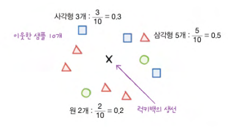
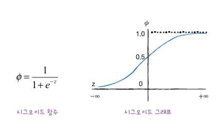
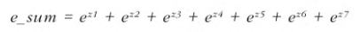
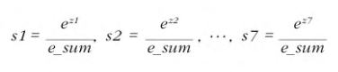
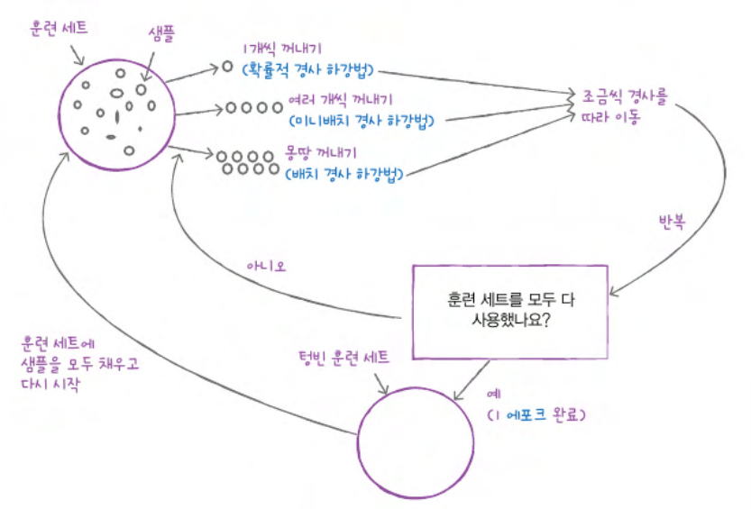
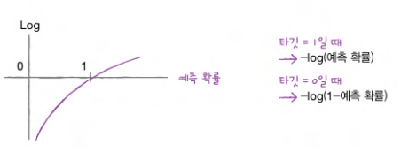
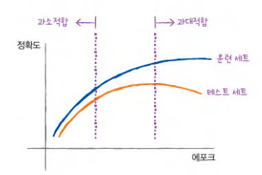
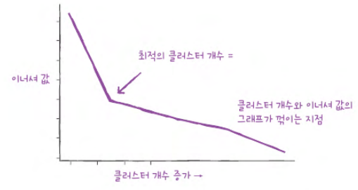

# Chapter 04 다양한 분류 알고리즘

## 04-1 로지스틱 회귀

> **핵심 키워드**: `로지스틱 회귀`, `다중 분류`, `시그모이드 함수`, `소프트맥스 함수`

- **럭키백의 확률**

    ```
    럭키백
    
    : 구성품을 모른 채 먼저 구매하고, 배송받은 다음에야 구성품을 알 수 있는 상품
    ```
    ```
    k-최근접 이웃 기법을 통해 이웃의 클래스 비율을 확률로 출력
    ```
    

    ```
    다중 분류(multi-class classification)
    : 타깃 데이터에 2개 이상의 클래스가 포함된 문제
    ```

- **로지스틱 회귀**

    ### $z = a × (Weight) + b × (Length) + c × (Diagonal) + d × (Height) + e × (Width) + f$

    $a, b, c, d$: 가중치 or 계수
    ```
    로지스틱 회귀(logistic regression)
    
    : 이름은 회귀이지만 분류 모델

    - 선형 회귀와 동일하게 선형 방정식을 학습
    ```
    ```
    시그모이드 함수(sigmoid function)
    = 로지스틱 함수(logistic function)
    
    : z가 아주 큰 음수일 때는 0이 되고, 아주 큰 양수일 때는 1이 되도록 하는 방법
    ```
    
    
    ```
    LogisticRegression 매개변수:

    1. max_iter
     : 반복 횟수를 지정

     - 기본값: 100
    
    2. L2 규제
     : 계수의 제곱을 규제

     - 릿지 회귀: alpha 매개변수
     - LogisticRegression: C 매개변수
     ▪️C는 alpha와 반대로 작을수록 규제가 커짐
     ▪️C의 기본 값은 1
    ```
    ```
    이진 분류
     - 시그모이드 함수를 사용해 z를 0과 1사이의 값으로 변환
    
    다중 분류
     - 소프트맥스 함수를 사용해 7개의 z값을 확률로 변환
    ```
    ```
    소프트맥스(softmax) 함수
    
    : 여러 개의 선형 방정식의 출려값을 0~1 사이로 압축하고 전체 합이 1이 되도록 하는 방법

    - 지수 함수를 사용하기 때문에 **정규화된 지수 함수**라고도 부름
    ```
    #### 계산 방식:

    1. $z1$ ~ $z7$까지 값을 사용해 지수 함수 $e^{z1}$ ~ $e^{z7}$을 계산해 모두 더함

        

    2. $e^{z1}$ ~ $e^{z7}$을 각각 $e$ _ $sum$으로 나누어 주면 됨
    
        

    $s1$에서 $s7$까지 모두 더하면 분자와 분모가 같아지므로 1이 됨
    
     -> 7개 생선에 대한 확률의 합은 1

- **확인 문제**

    ```
    1. 2개보다 많은 클래스가 있는 분류 문제를 무엇이라 부르나요?
    ① 이진 분류
    ② 다중 분류
    ③ 단변량 회귀
    ④ 다변량 회귀

    정답: 2️⃣
    ```
    ```
    2. 로지스틱 회귀가 이진 분류에서 확률을 출력하기 위해 사용하는 함수는 무엇인가요?
    ① 시그모이드 함수
    ② 소프트맥스 함수
    ③ 로그 함수
    ④ 지수 함수

    정답: 1️⃣
    ```
    ```
    3. decision_function() 메서드의 출력이 0일 때 시그ㅗ이드 함수의 값은 얼마인가요?
    ① 0
    ② 0.25
    ③ 0.5
    ④ 1

    정답: 3️⃣
    ```

## 04-2 확률적 경사 하강법

> **핵심 키워드**: `확률적 경사 하강법`, `손실 함수`, `에포크`

- **점진적인 학습**

    ```
    당면한 문제
    : 훈련 데이터가 한 번에 준비되는 것이 아니라 조금씩 전달된다는 것

    점진적 학습
    
    : 앞서 훈련한 모델을 버리지 않고 새로운 데이터에 대해서만 조금씩 더 훈련을 하는 것
    
    대표적인 점진적 학습 알고리즘
    : 확률적 경사 하강법(Stochastic Gradient Descent)
    ```

- **확률적 경사 하강법**

    ```
    목표
    : 가장 가파른 경사를 따라 원하는 지점에 도달하는 것

    과정:
    
    1. 훈련 세트에서 랜덤하게 하나의 샘플을 선택하여 가파른 경사를 조금 내려감

    2. 그다음 훈련 세트에서 랜덤하게 또 다른 샘플을 하나 선택하여 경사를 조금 내려감

    3. 전체 샘플을 모두 사용할 때까지 계속함

    4. 만족할만한 위치에 도달할 때까지 1~3의 과정을 반복
    ```
    ```
    에포크(epoch)
    : 확률적 경사 하강법에서 훈련 세트를 한 번 모두 사용하는 과정

    - 일반적으로 경사 하강법은 수십, 수백 번 이상 에포크를 수행행
    ```
    ```
    미니배치 경사 하강법(minibatch gradient descent)

    : 여러 개의 샘플을 사용해 경사 하강법을 수행하는 방식

    배치 경사 하강법(batch gradient descent)
    
    : 한 번 경사로를 따라 이동하기 위해 전체 샘플을 사용하는 방식 
    ```
    

- **손실 함수(loss function)**

    ```
    손실 함수
    : 어떤 문제에서 머신러닝 알고리즘이 얼마나 엉터리인지를 측정하는 기준

    v.s. 비용 함수(cost function)
    
    - 손실 함수
     : 샘플 하나에 대한 손실을 정의

    - 비용 함수
     : 훈련 세트에 있는 모든 샘플에 대한 소실 함수의 합을 의미
    ```

- **로지스틱 손실 함수(logistic loss function)**

    ```
    로지스틱 손실 함수
    = 이진 크로스엔트로피 손실 함수(binary cross-entropy loss function)

    양성 클래스일 때 손실은 -log(예측 확률)로 계산

    - 예측 확률이 1에서 멀어질수록 손실은 아주 큰 양수가 됨

    음성 클래스일 때 손실은 -log(1-예측 확률)로 계산

    - 예측 확률이 0에서 멀어질수록 손실은 아주 큰 양수가 됨
    ```
    
    ```
    이진 분류
    - 로지스틱 손실 함수

    다중 분류
    - 크로스엔트로피 손실 함수
    ```

- **에포크와 과대/과소적합**

    ```
    적은 에포크 횟수
    : 이 동안에 훈련한 모델은 훈련 세트와 테스트 세트에 잘 맞지 않는 과소적합된 모델일 가능성이 높음

    많은 에포크 횟수
    : 이 동안에 훈련한 모델은 훈련 세트에 너무 잘 맞아 테스트 세트에는 오히려 점수가 나쁜 과대적합된 모델일 가능성이 높음

    조기 종료(early stopping)
    : 과대적합이 시작하기 전에 훈련으 멈추는 것
    ```
    

- **확인 문제**

    ```
    1. 다음 중 표준화 같은 데이터 전처리를 수행하지 않아도 되는 방식으로 구현된 클래스는 무엇인가요?
    ① KNeighborsClassifier
    ② LinearRegression
    ③ Ridge
    ④ SGDClassifier

    정답: 4️⃣
    ```
    ```
    2. 경사 하강법 알고리즘의 하나로 훈련 세트에서 몇 개의 샘플을 뽑아서 훈련하는 방식은 무엇인가요?
    ① 확률적 경사 하강법
    ② 배치 경사 하강법
    ③ 미니배치 경사 하강법
    ④ 부분배치 경사 하강법

    정답: 3️⃣
    ```

# Chapter 06 비지도 학습

## 06-1 군집 알고리즘

> **핵심 키워드**: `비지도 학습`, `히스토그램`, `군집`

```
군집(clustering)
: 비슷한 샘플끼리 그룹으로 모으는 작업
```

- **확인 문제**

    ```
    1. 히스토그램을 그릴 수 있는 맷플롯립 함수는 무엇인가요?
    ① hist()
    ② scatter()
    ③ plot()
    ④ bar()

    정답: 1️⃣
    ```

## 06-2 k-평균

> **핵심 키워드**: `k-평균`, `클러스터 중심`, `엘보우 방법`

- **k-평균 알고리즘 소개**

    ```
    작동 방식:

    1. 무작위로 k개의 클러스터 중심을 정함
    
    2. 각 샘플에서 가장 가까운 클러스터 중심을 찾아 해당 클러스터의 샘플로 지정

    3. 클러스터에 속한 샘플의 평균값으로 클러스터 중심을 변경

    4. 클러스터 중심에 변화가 없을 때까지 2번으로 돌아가 반복
    ```
    

- **최적의 k 찾기**

    ```
    클러스터 개수를 사전에 지정해야 함
     -> k-평균 알고리즘의 단점 중 하나
    
    k-평균 알고리즘은 클러스터 중심과 클러스터에 속한 샘플 사이의 거리를 잴 수 있음

    이너셔(inertia)
    : 위에서 언급한 거리의 제곱 합

    엘보우(elbow) 방법
    : 클러스터 개수를 늘려가면서 이너셔의 변화를 관찰하여 최적의 클러스터 개수를 찾는 방법
    ```
    

- **확인 문제**

    ```
    1. k-평균 알고리즘에서 클러스터를 표현하는 방법이 아닌 것은 무엇인가요?
    ① 클러스터에 속한 샘플의 평균
    ② 클러스터 중심
    ③ 센트로이드
    ④ 클러스터에 속한 샘플 개수

    정답: 4️⃣
    ```
    ```
    1. k-평균에서 최적의 클러스터 개수는 어떻게 정할 수 있나요?
    ① 엘보우 방법을 사용해 이너셔의 감소 정도가 꺾이는 클러스터 개수를 찾습니다.
    ② 랜덤하게 클러스터 개수를 정해서 k-평균 알고리즘을 훈련하고 가장 낮은 이너셔가 나오는 클러스터 개수를 찾습니다.
    ③ 훈련 데이터를 모두 조사하여 몇 개의 클러스터가 나올 수 있는지 직접 확인합니다.
    ④ 교차 검증을 사용하여 최적의 클러스터 개수를 찾습니다.

    정답: 1️⃣
    ```