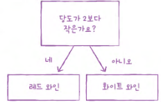
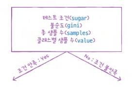
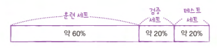
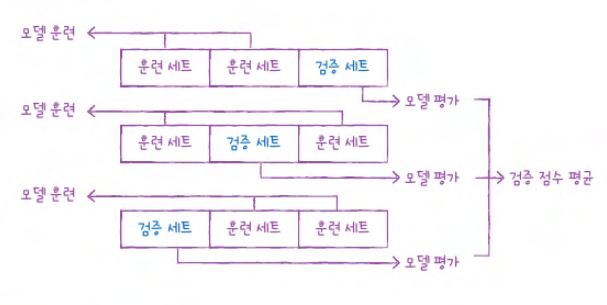
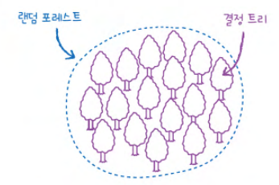
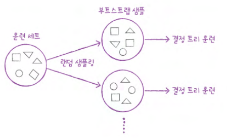
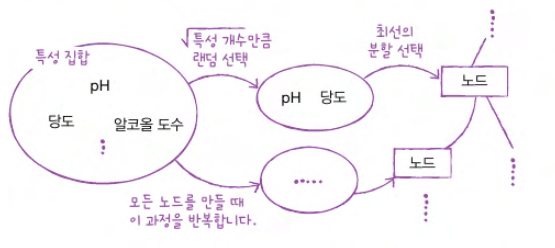

# Chapter 05 트리 알고리즘

## 05-1 결정 트리

> **핵심 키워드**: `결정 트리`, `불순도`, `정보 이득`, `가지치기`, `특성 중요도`

- **결정 트리(Decision Tree)**

    ```
    특징:

    - 이유를 설명하기 쉬움
    - 데이터를 잘 나눌 수 있는 질문을 찾는다면 질문을 계속 추가해서 분류 정확도를 높일 수 있음
    ```
    
    ```
    노드(node)
    
    : 훈련 데이터의 특성에 대한 테스트를 표현

    ex. 현재 샘플의 당도가 -0.239보다 작거나 같은지 테스트

    - 결정 트리를 구성하는 핵심 요소
    - 하나의 노드는 2개의 가지를 가짐
    ▪ 맨 위의 노드: 루트 노드(root node)
    ▪ 맨 아래 끝에 달린 노드: 리프 노드(leaf node)

    가지(branch)

    : 테스트의 결과(True, False)를 나타냄
    ```
    

- **불순도**

    ```
    지니 불순도(Gini Impurity)

    : 데이터를 분할할 기준을 정하는 데 사용

    - DesicionTreeClassifier criterion 매개변수의 기본 값
    ```
    #### 지니 불순도 계산법
    
    - $지니 불순도 = 1 - (음성 클래스 비율^2 + 양성 클래스 비율^2)$

    ```
    결정 트리 모델은 부모 노드와 자직 노드의 불순도 차이가 가능한 크도록 트리를 성장시킴
    ```
    #### 불순도 차이 계산법
    
    - $부모의 불순도 - (왼쪽 노드 샘플 수 / 부모의 샘플 수) × 왼쪽 노드 불순도 - (오른쪽 노드 샘플 수 / 부모의 샘플 수) × 오른쪽 노드 불순도$

    ```
    정보 이득(information gain)
    
    : 부모와 자식 노드 사이의 불순도 차이
    ```

    ```
    엔트로피(entropy) 불순도

    - 노드의 클래스 비율을 사용
    - 지니 불순도와 달리 제곱이 아닌 밑이 2인 로그를 사용하여 곱함
    ```
    #### 엔트로피 불순도 계산법
    $엔트로피 불순도 = -음성 클래스 비율 × log_2(음성 클래스 비율) - 양성 클래스 비율 × log_2(양성 클래스 비율)$

    ```
    결정 트리 알고리즘 정리:

    - 불순도 기준을 사용해 정보 이득이 최대가 되도록 노드를 분할
    - 노드를 순수하게 나눌수록 정보 이득↑
    - 새로운 샘플에 대해 예측할 때에는 노드의 질문에 따라 트리를 이동
    - 마지막에 도달한 노드의 클래스 비율을 보고 예측
    ```

- **가지치기**

    ```
    가지치기를 하지 않으면 무작정 끝까지 자라나는 트리가 만들어짐

    이로 발생할 수 있는 문제점

    - 과적합 발생
    - 일반화의 어려움

    결정 트리에서 가지치기를 하는 가장 간단한 방법

    : 트리의 최대 깊이 지정

    결정 트리 알고리즘의 장점:

    1. 표준화 전처리 과정이 필요 없음
     -> 특성 값의 스케일이 알고리즘에 아무런 영향을 미치지 않기 때문

    2. 결정 트리의 특성 중요도를 특성 선택에 활용할 수 있음음
    ```
- **확인 문제**

    ```
    1. 다음 중 결정 트리의 불순도에 대해 옳게 설명한 것을 모두 고르세요.
    ① 지니 불순도는 부모 노드의 불순도와 자식 노드의 불순도의 차이로 계산합니다.
    ② 지니 불순도는 클래스의 비율을 제곱하여 모두 더한 다음 1에서 뺍니다.
    ③ 엔트로피 불순도는 1에서 가장 큰 클래스 비율을 빼서 계산합니다.
    ④ 엔트로피 불순도는 클래스 비율과 클래스 비율에 밑이 2인 로그를 적용한 값을 곱해서 모두 더한 후 음수로 바꾸어 계산합니다.

    정답: 2️⃣, 4️⃣
    ```
    ```
    2. 결정 트리에서 계산한 특성 중요도가 저장되어 있는 속성은 무엇인가요?
    ① important_variables
    ② variable_importances
    ③ important_features
    ④ feature_importances

    정답: 4️⃣
    ```

## 05-2 교차 검증과 그리드 서치

> **핵심 키워드**: `검증 세트`, `교차 검증`, `그리드 서치`, `랜덤 서치`

- **검증 세트**

    ```
    테스트 세트를 사용하지 않으면 모델이 과대적합인지 과소적합인지 판단하기 어려움

    해결책:
    
    훈련 세트를 또 나눈 검증 세트(validation set)를 통해 측정할 수 있음

    전체 절차:

    1. 훈련 세트에서 모델을 훈련하고 검증 세트로 모델을 평가
    
    2. 테스트하고 싶은 매개변수를 바꿔가며 가장 좋은 모델을 선택
    
    3. 해당 매개변수를 사용해 훈련 세트와 검증 세트를 합쳐 모델을 다시 훈련

    4. 최종적으로 테스트 세트에서의 점수를 평가 
    ```
    

- **교차 검증**

    ```
    교차 검증(cross validation)
    
    : 검증 세트를 떼어 내어 평가하는 과정을 여러 번 반복하고 점수를 평균하여 최종 검증 점수를 얻는 방식

    교차 검증을 수행하면 입력한 모델에서 얻을 수 있는 최상의 검증 점수를 가늠해 볼 수 있음
    ```
    

- **하이퍼파라미터 튜닝**

    ```
    모델 파라미터

    : 머신러닝 모델이 학습하는 파라미터

    하이퍼파라미터

    : 모델이 학습할 수 없어서 사용자가 지정해야만 하는 파라미터

    한 매개변수의 최적값을 찾고 다른 매개변수의 최적값을 찾는 방식은 잘못됨

     이유: 한 매개변수의 최적값은 다른 매개변수의 값이 바뀌면 함께 달라지기 때문
     -> 즉 두 매개변수를 동시에 바꿔가며 최적의 값을 찾아야 함
    
    그리드 서치(Grid Search)

    - 하이퍼파라미터 탐색괴 교차 검증을 한 번에 수행
    ```

- **랜덤 서치**

    ```
    매개변수의 값이 수치일 때 값의 범위나 간격을 미리 정하기 어려움

    랜덤 서치(Random Search)

    : 매개변수 값의 목록을 전달하는 것이 아닌 매개변수를 샘플링할 수 있는 확률 분포 객체를 전달하는 방식
    ```

- **확인 문제**

    ```
    1. 훈련 세트를 여러 개의 폴드로 나누고 폴드 1개는 평가 용도로, 나머지 폴드는 훈련 용도로 사용합니다. 그다음 모든 폴드를 평가 용도로 사용하게끔 폴드 개수만큼 이 과정을 반복합니다. 이런 평가 방법을 무엇이라고 부르나요?

    ① 교차 검증
    ② 반복 검증
    ③ 교차 평가
    ④ 반복 평가

    정답: 1️⃣
    ```
    ```
    2. 다음 중 교차 검증을 수행하지 않는 함수나 클래스는 무엇인가요?

    ① cross_validate ()
    ② GridSearchCV
    ③ RandomizedSearchCV
    ④ train_test_split

    정답: 4️⃣
    ```

## 05-3 트리의 앙상블

> **핵심 키워드**: `앙상블 학습`, `랜덤 포레스트`, `엑스트라 트리`, `그레이디언트 부스팅`

```
가장 좋은 알고리즘이 있다고 해서 다른 알고리즘을 배울 필요가 없는 것은 아님
```

- **정형 데이터와 비정형 데이터**

    ```
    정형 데이터를 다루는 데 가장 뛰어난 성과를 내는 알고리즘

    : 앙상블 학습(ensemble learning)

     - 대부분 결정 트리를 기반으로 만들어짐

    비정형 데이터는 신경망 알고리즘을 사용해야 함

    이유: 데이터의 규칙성을 찾기 어려워 전통적인 머신러닝 방법으로는 모델을 만들기 까다롭기 때문
    ```

- **랜덤 포레스트**

    ```
    랜덤 포레스트(Random Forest)

    : 결정 트리를 랜덤하게 만들어 결정 트리의 숲을 만들고 각 결정 트리의 예측을 사용해 최종 예측을 만드는 모델

    - 앙상블 학습의 대표 주자 중 하나
    ```
    
    
    ```
    랜덤 포레스트는 각 트리를 훈련하기 위해 입력한 훈련 데이터에서 랜덤하게 샘플을 추출하여 훈련 데이터를 만듦

    이때 한 샘플이 중복되어 추출될 수 있음 = 부트스트랩 샘플(bootstrap sample)

    기본적으로 부트스트랩 샘플은 훈련 크기와 같게 만듦

    ex. 1,000개 가방에서 중복하여 1,000개의 샘플을 뽑음
     -> 부트스트랩 샘플 크기 = 훈련 세트 크기 
    ```
    
    ```
    각 노드를 분할할 때 전체 특성 중에서 일부 특성을 무작위로 고른 다음 이 중에서 최선의 분할을 찾음

    분류 모델 RandomForestClassifier:

    - 기본적으로 전체 특성 개수의 제곱근만큼 특성을 선택

    ex. 4개의 특성이 있다면 노드마다 2개를 랜덤하게 선택하여 사용

    회귀 모델 RandomForestRegressor:

    - 전체 특성 사용
    ```
    
    ```
    랜덤 포레스트 특징:

    - 랜덤하게 선택한 샘플과 특성을 사용
     -> 훈련 세트에 과대적합되는 것을 막아주고 검증 세트와 테스트 세트에서 안정적인 성능을 얻을 수 있음
    - 기본 매개변수 설정만으로도 아주 좋은 결과를 냄

    랜덤 포레스트의 특별한 기능:

    OOB(out of bag)
    : 부트스트랩 샘플에 포함되지 않고 남는 샘플

    이 남은 샘플을 사용하여 부트스트랩 샘플로 훈련한 결정 트리를 평가할 수 있음 just like 검증세트
    ```

- **엑스트라 트리**

    ```
    엑스트라 트리(Extra Trees)

    랜덤 포레스트와의 공통점:

    - 기본적으로 100개의 결정 트리를 훈련
    - 결정 트리가 제공하는 대부분의 매개변수를 지원
    - 전체 특성 중 일부 특성을 랜덤하게 선택하여 노드를 분할

    랜덤 포레스트와의 차이점:

    - 부트스트랩 샘플을 사용하지 않음
    - 결정 트리를 만들 때 전체 훈련 세트를 사용
    - 노드를 분할할 때 가장 좋은 분할을 찾는 것이 아닌 무작위로 분할
    - 빠른 계산 속도

    무작위 분할의 효과:

    하나의 결정 트리에서 특성을 무작위로 분할한다면 성능이 낮아지겠지만 많은 트리를 앙상블 하기 때문에 과대적합을 막고 검증 세트의 점수를 높이는 효과가 있음
    ```

- **그레이디언트 부스팅**

    ```
    그레이디언트 부스팅(gradient boosting)
    
    : 깊이가 얕은 결정 트리를 사용하여 이전 트리의 오차를 보완하는 방식으로 앙상블 하는 방법

    - 기본적으로 깊이가 3인 결정 트리를 100개 사용
    - 과대적합에 강하고 일반적으로 높은 일반화 성능을 기대할 수 있음
    - 경사 하강법을 사용하여 트리를 앙상블에 추가
        - 분류: 로지스틱 손실 함수 사용
        - 회귀: 평균 제곱 오차 함수 사용

    깊이가 얕은 트리를 사용하는 이유:

    - 그레이디언트 부스팅은 결정 트리를 계속 추가하면서 가장 낮은 곳을 찾아 이동
     -> 이때 낮은 곳으로 천천히 조금씩 이동해야 하기 때문
    - 학습률 매개변수로 속도를 조절
    ```

- **히스토그램 기반 그레이디언트 부스팅**

    ```
    히스토그램 기반 그레이디언트 부스팅(Histogram-based Gradient Boosting)

    - 정형 데이터를 다루는 머신러닝 알고리즘 중에 가장 인기가 높음
    - 입력 특성을 256개의 구간으로 나눔
    - 노드를 분할할 때 최적의 분할을 매우 빠르게 찾을 수 있음
    - 256개의 구간 중에서 하나를 떼어 놓고 누락된 값을 위해 사용
     -> 입력에 누락된 특성이 있더라도 이를 따로 전처리할 필요가 없음
    ```

- **확인 문제**

    ```
    1. 여러 개의 모델을 훈련시키고 각 모델의 예측을 취합하여 최종 결과를 만드는 학습 방식을 무엇이라고 부르나요?

    ① 단체 학습
    ② 오케스트라 학습
    ③ 심포니 학습
    ④ 앙상블 학습

    정답: 4️⃣
    ```
    ```
    2. 다음 중 비정형 데이터에 속하는 것은 무엇인가요?

    ① 엑셀 데이터
    ② CSV 데이터
    ③ 데이터베이스 데이터
    ④ 이미지 데이터

    정답: 4️⃣
    ```
    ```
    3. 다음 알고리즘 중 기본적으로 부트스트랩 샘플을 사용하는 알고리즘은 무엇인가요?

    ① 랜덤 포레스트
    ② 엑스트라 트리
    ③ 그레이디언트 부스팅
    ④ 히스토그램 기반 그레이디언트 부스팅

    정답: 1️⃣
    ```