## 06-3 주성분 분석

> **핵심 키워드**: `차원 축소`, `주성분 분석`, `설명된 분산`

- **차원과 차원 축소**

    ```
    데이터가 가진 속성 = 속성 = 차원(dimension)
    ```
    ```
    2차원 배열과 1차원 배열의 차원은 다른가?

    다차원 배열에서의 차원: 배열의 축 개수

    ex. 2차원 배열일 때는 행과 열이 차원이 됨

    1차원 배열에서의 차원: 원소의 개수
    ```
    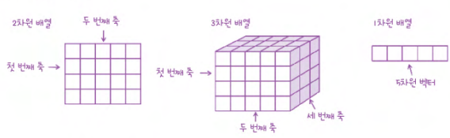

    ```
    차원 축소(dimensionality reduction)

    : 데이터를 가장 잘 나타내는 일부 특성을 선택하여 데이터 크기를 줄이고 지도 학습 모델의 성능을 향상시킬 수 있는 방법
    ```

- **주성분 분석(principal component analysis)**

    ```
    주성분 벡터

    : 원본 데이터에 있는 어떤 방향

    - 주성분 벡터의 원소 개수는 원본 데이터셋에 있는 특성 개수와 같음

    **주성분은 원본 차원과 같고 주성분으로 바꾼 데이터는 차원이 줄어듦**

    주성분 = 가장 분산이 큰 방향
     -> 주성분에 투영하여 바꾼 데이터는 원본이 가지고 있는 특성을 가장 잘 나타냄

    첫 번째 주성분을 찾은 다음 이 벡터에 수직이고 분산이 가장 큰 다음 방향을 찾음 -> 이게 곧 두 번째 주성분 
    ```
    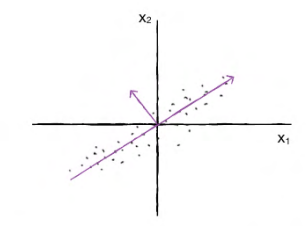

- **설명된 분산**

    ```
    설명된 분산(explained variance)

    : 주성분이 원본 데이터의 분산을 얼마나 잘 나타내는지 기록한 값
    ```

- **확인 문제**

    ```
    1. 특성이 20개인 대량의 데이터셋이 있습니다. 이 데이터셋에서 찾을 수 있는 주성분 개수는 몇 개일까요?
    ① 10개
    ② 20개
    ③ 50개
    ④ 100개

    정답: 2️⃣
    ```
    ```
    2. 샘플 개수가 1,000개이고 특성 개수는 100개인 데이터셋이 있습니다. 즉 이 데이터셋의 크기는 (1000, 100)입니다. 이 데이터를 사이킷런의 PCA 클래스를 사용해 10개의 주성분을 찾아 변환했습니다. 변환된 데이터셋의 크기는 얼마일까요?
    ① (1000, 10)
    ② (10, 1000)
    ③ (10, 10)
    ④ (1000, 1000)

    정답: 1️⃣
    ```
    ```
    3. 2번 문제에서 설명된 분산이 가장 큰 주성분은 몇 번째인가요?
    ① 첫 번째 주성분
    ② 다섯 번째 주성분
    ③ 열 번째 주성분
    ④ 알 수 없음

    정답: 1️⃣
    ```

# Chapter 07 딥러닝을 시작합니다

## 07-1 인공 신경망

> **핵심 키워드**: `인공 신경망`, `텐서플로`, `밀집층`, `원-핫 인코딩`

- **인공 신경망**

    ```
    인공 신경망(artificial neural network, ANN)

    뉴런(neuron) = 유닛(unit)

    : 인공 신경망에서는 z값을 계산하는 단위

    - 뉴런에서 일어나는 일은 선형 계산이 전부

    입력층(input layer)

    : 픽셀값 자체이고 특별한 계산을 수행하지 않음
    ```
    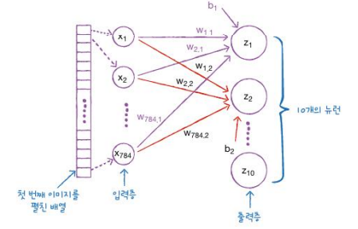

    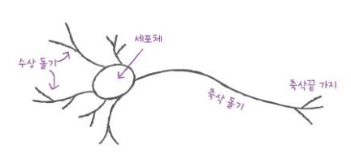
    ```
    생물학적 뉴런은 수상 돌기로부터 신호를 받아 세포체에 모으고 신호가 어떤 임 값에 도달하면 축삭 돌기를 통하여 다른 세포에 신호를 전달함
    ```

    ```
    밀집층(dense layer) = 완전 연결층(fully connected layer)

    - 784개의 픽셀과 10개의 뉴런이 빽빽하게 연결됨
    - 층이 양쪽의 뉴런을 모두 연결
    ```
    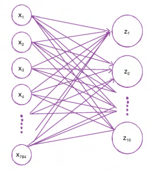

    ```
    절편은 뉴런마다 더해짐

    활성화 함수(activation function)

    : 뉴런의 선형 방정식 계산 결과에 적용되는 함수
    ```

    ```
    원-핫 인코딩(one-hot encoding)

    : 타깃값을 해당 클래스만 1이고 나머지는 모두 0인 배열로 만드는 것
    ```

- **확인 문제**

    ```
    1. 어떤 인공 신경망의 입력 특성이 100개이고 밀집층에 있는 뉴런 개수가 10개일 때 필요한 모델 파라미터의 개수는 몇 개인가요?
    ① 1,000개
    ② 1,001개
    ③ 1,010개
    ④ 1,100개

    정답: 3️⃣
    ```
    ```
    2. 케라스의 Dense 클래스를 사용해 신경망의 출력층을 만들려고 합니다. 이 신경망이 이진 분류 모델이라면 activation 매개변수에 어떤 활성화 함수를 지정해야 하나요?
    ① 'binary'
    ② 'sigmoid'
    ③ 'softmax'
    ④ 'relu'

    정답: 2️⃣
    ```
    ```
    3. 케라스 모델에서 손실 함수와 측정 지표 등을 지정하는 메서드는 무엇인가요?
    ① configure()
    ② fit()
    ③ set()
    ④ compile ()

    정답: 4️⃣
    ```
    ```
    4. 정수 레이블을 타깃으로 가지는 다중 분류 문제일 때 케라스 모델의 compile() 메서드에 지정할 손실 함수로 적절한 것은 무엇인가요?
    ① 'sparse_categorical_crossentropy'
    ② 'categorical_crossentropy'
    ③ 'binary_crossentropy'
    ④ 'mean_square_error'

    정답: 1️⃣
    ```

## 07-2 심층 신경망

> **핵심 키워드**: `심층 신경망`, `렐루 함수`, `옵티마이저`

- **2개의 층**

    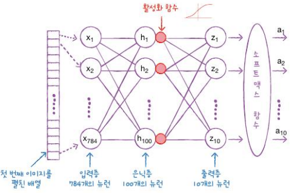
    ```
    은닉층(hidden layer)

    : 입력층과 출력층 사이에 있는 모든 층

    - 출력층에 적용하는 활성화 함수는 종류가 제한되어 있음
        - 이진 분류: 시그모이드 함수
        - 다중 분류: 소프트맥스 함수
        
    - 이에 비해 은닉층의 활성화 함수는 비교적 자유로움
    ```
    ```
    회귀를 위한 신경망의 출력층에서는 어떤 활성화 함수를 사용?

    - 회귀의 출력은 임의의 어떤 숫자이므로 활성화 함수를 적용할 필요가 없음
     -> 출력층의 선형 방정식의 계산을 그대로 출력
     -> Dense 층의 activation 매개변수에 아무런 값을 지정하지 않음
    ```
    
    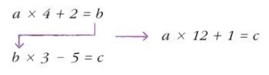
    ```
    은닉층에 활성화 함수를 적용하는 이유:

    첫 번째 식에서 계산된 b가 두 번째 식에서 c를 계산하기 위해 쓰임
    
    하지만 두 번째 식에 첫 번째 식을 대입하면 오른쪽처럼 하나로 합쳐질 수 있음 
     -> 이렇게 되면 b는 사라지고 b가 하는 일이 없음
    ```

    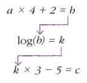
    ```
    은닉층에서 선형적인 산술 계산만 수행한다면 수행 역할이 없음
    
    선형 계산을 적당하게 비선형적으로 비틀어 주어야 다음 층의 계산과 단순히 합쳐지지 않고 나름의 역할을 할 수 있음
    ```

- **렐루 함수**

    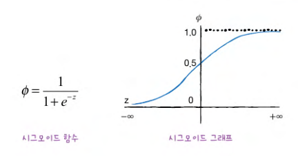
    ```
    시그모이드 함수의 단점:

    오른쪽과 왼쪽 끝으로 갈수록 그래프가 누워있기 때문에 올바른 출력을 만드는데 신속하게 대응하지 못함

    특히 층이 많은 심층 신경망일수록 그 효과가 누적되어 학습을 더 어렵게 만듦
    ```
    
    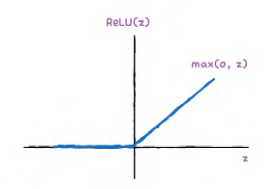
    ```
    렐루(ReLU) 함수
    
    : 입력이 양수일 경우 마치 활성화 함수가 없는 것처럼 그냥 입력을 통과시키고 음수일 경우에는 0으로 만듦

    렐루 함수는 max (0, z)와 같이 쓸 수 있음
     -> z가 0보다 크면 z를 출력하고 z가 0보다 작으면 0을 출력
    ```

- **옵티마이저**

    ```
    인공신경망에서의 하이퍼파라미터:
    
    - 추가할 은닉층의 개수
    - 뉴런 개수
    - 활성화 함수
    - 층의 종류
    - 배치 사이즈 매개변수
    - 에포크 매개변수 등...
    ```
    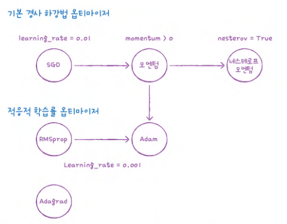

- **확인 문제**

    ```
    1. 다음 중 모델의 add() 메서드 사용법이 올바른 것은 어떤 것인가요?
    ① model.add(keras.layers.Dense)
    ② model.add(keras.layers.Dense (10, activation=relu'))
    ③ model,add(keras.layers.Dense, 10, activation='relu')
    ④ model.add(keras.layers.Dense) (10, activation='relu')

    정답: 2️⃣
    ```
    ```
    2. 크기가 300 × 300인 입력을 케라스 층으로 펼치려고 합니다. 다음 중 어떤 층을 사용해야 하나요?
    ① Plate
    ② Flatten
    ③ Normalize
    ④ Dense

    정답: 2️⃣
    ```
    ```
    3. 다음 중에서 이미지 분류를 위한 심층 신경망에 널리 사용되는 케라스의 활성화 함수는 무엇인가요?
    ① linear
    ② sigmoid
    ③ relu
    ④ tanh

    정답: 3️⃣
    ```
    ```
    4. 다음 중 적응적 학습률을 사용하지 않는 옵티마이저는 무엇인가요?
    ① SGD
    ② Adagrad
    ③ RMSprop
    ④ Adam

    정답: 1️⃣
    ```

## 07-3 신경망 모델 훈련

> **핵심 키워드**: `드롭아웃`, `콜백`, `조기 종료`

- **드롭아웃**

    ```
    드롭아웃(dropout)

    : 훈련 과정에서 층에 있는 일부 뉴런을 랜덤하게 꺼서(즉 뉴런의 출력을 0으로 만들어) 과대적합을 막음

    - 이전 층의 일부 뉴런이 랜덤하게 꺼지면 특정 뉴런에 과대하게 의존하는 것을 줄일 수 있고 모든 입력에 대해 주의를 기울여야 하기 때문
    ```
    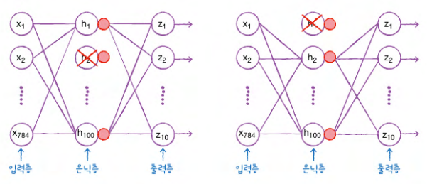

- **콜백**

    ```
    조기 종료(early stopping)
    
    : 과대적합이 시작되기 전에 훈련을 미리 중지하는 것
    ```

- **확인 문제**

    ```
    1. 케라스 모델의 fit () 메서드에 검증 세트를 올바르게 전달하는 코드는 무엇인가요?
    ① model.fit(..., val_input=val_input, val_target=val_target)
    ② model.fit(..., validation_input=val_input, validation_target=val_target)
    ③ model.fit(..., val_data=(val_input, val_target))
    ④ model.fit(...,validation_data=(val_input, val_target))

    정답: 4️⃣
    ```
    ```
    2. 이전 층의 뉴런 출력 중 70%만 사용하기 위해 드롭아웃 층을 추가하려고 합니다. 다음 중 옳게 설정한 것은 무엇인가요?
    ① Dropout(0.7)
    ② Dropout(0.3)
    ③ Dropout(1/0.7)
    ④ Dropout(1/0.3)

    정답: 2️⃣
    ```
    ```
    3. 케라스 모델의 가중치만 저장하는 메서드는 무엇인가요?
    ① save()
    ② load_model()
    ③ save_weights()
    ④ load_weights ()

    정답: 3️⃣
    ```
    ```
    4. 케라스의 조기 종료 콜백을 사용하려고 합니다. 3번의 에포크 동안 손실이 감소되지 않으면 종료하고 최상의 모델 가중치를 복원하도록 올바르게 설정한 것은 무엇인가요?
    ① EarlyStopping(monitor=loss', patience=3)
    ② EarlyStopping(monitor=val_loss', patience=3, restore_best_weights=True)
    ③ EarlyStopping(monitor='accuracy', patience=3)
    ④ EarlyStopping(monitor='val_accuracy', patience=3, restore_best_weights=True)

    정답: 2️⃣
    ```
    
    