# Chapter 08 이미지를 위한 인공 신경망

## 08-1 합성곱 신경망의 구성 요소

> **핵심 키워드**: `합성곱`, `필터`, `특성 맵`, `패딩`, `스트라이드`, `풀링`

- **합성곱(convolution)**

    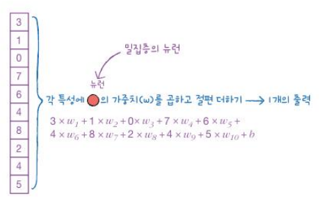
    ```
    기존 인공 신경망의 경우 가중치와 절편을 랜덤하게 초기화한 다음  에포크를 반복하면서 경사 하강법 알고리즘을 사용하여 손실이 낮아지도록 최적의 가중치와 절편을 찾아감

    ex. 밀집층에 뉴런이 3개 있다면 출력 또한 3개가 됨
     -> 이는 입력 개수에 상관없이 동일함
    ```

    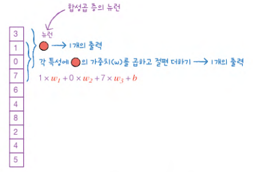

    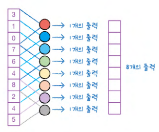
    ```
    합성곱의 밀집층은 이와 다르게 입력 데이터 전체에 가중치를 적용하는 것이 아니라 일부에 가중치를 곱함

    한 칸씩 아래로 이동하면서 출력을 만드는 것이 합성곱

    밀집층의 뉴런은 입력 개수만큼 10개의 가중치를 가지고 1개의 출력을 만들지만, 합성곱 층의 뉴런은 3개의 가중치를 가지고 8개의 출력을 만듦
     -> 하이퍼마라미터로 합성곱 층의 뉴런에 있는 가중치 개수는 정하기 나름

    합성곱 신경망(convolutional neural network, CNN)에서는 완전 연결 신경망과 달리 뉴런을 필터(filter)라고 or 커널 (kernel)이라고도 부름
    
    뉴런 = 필터 = 커널

    커널: 입력에 곱하는 가중치
    필터: 뉴런 개수를 표현할 때 사용

    합성곱의 장점

    : 1차원뿐 아니라 2차원 입력에도 적용 가능

    입력이 2차원 배열이면 필터도 2차원이어야 함
    
    여기서 필터의 커널 크기는 (3.3)으로 가정
     -> 앞에서도 언급했지만 커널 크기는 우리가 지정해야 할 하이퍼파라미터

    왼쪽 위 모서리에서부터 합성곱을 시작해 입력의 9개 원소와 커널의 9개 가중치를 곱한 후 1개의 출력을 만듦
    ```
    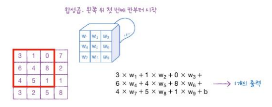

    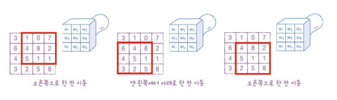

    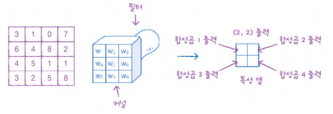
    ```
    이때 4개의 출력을 필터가 입력에 놓인 위치에 맞게 2차원으로 배치

    특성 맵(feature map)

    : 합성곱 계산을 통해 얻은 출력

    밀집층에서 여러 개의 뉴런을 사용하듯이 합성곱 층에서도 여러 개의 필터를 사용
    
    여러 개의 필터를 사용하면 만들어진 특성 맵은 순서대로 차곡차곡 쌓임 
    
    (2, 2) 크기의 특성 맵을 쌓으면 3차원 배열이 되고, 여기에서는 3개의 필터를 사용했기 때문에 (2, 2, 3) 크기의 3차원 배열이 됨
    ```
    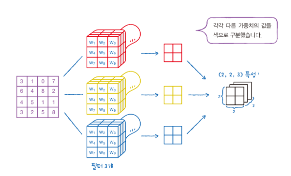

    ```
    기존 밀집층과의 차이점 정리:

    - 실제 계산은 밀집층과 동일하게 단순히 입력과 가중치를 곱하는 것이지만 2차원 형태를 유지하는 점이
    다름
    
    -  입력보다 훨씬 작은 크기의 커널을 사용하고 입력 위를 (왼쪽에서 오른쪽으로, 위에서 아래로) 이동하면서 2차원 특성 맵을 만든다는 점에서 차이가 있음

    이렇게 2차원 구조를 그대로 사용하기 때문에 합성곱 신경망이 이미지 처리 분야에서 뛰어난 성능을 발휘함

    합성곱 신경망

    : 일반적으로 1개 이상의 합성곱 층을 쓴 인공 신경망
    
    - 즉, 꼭 합성곱 층만 사용한 신경망을 합성곱 신경망이라고 부르는 것은 아님
    
    - 클래스에 대한 확률을 계산하려면 마지막 층에 클래스 개수만큼의 뉴런을 가진 밀집층을 두는 것이 일반적이기 때문
    ```

- **패딩과 스트라이드**

    ```
    앞에서 예로 들었던 합성곱 계산은 (4, 4) 크기의 입력에 (3, 3) 크기의 커널을 적용하여 (2, 2) 크기의 특성 맵을 만듦
    
    만약 커널 크기는 (3, 3)으로 그대로 두고 출력의 크기를 입력과 동일하게 (4,4)로 만들려면 어떻게 할 수 있을까?

    (4, 4) 입력과 동일한 크기의 출력을 만들려면 마치 더 큰 입력에 합성곱하는 척을 해야 함
    ```
    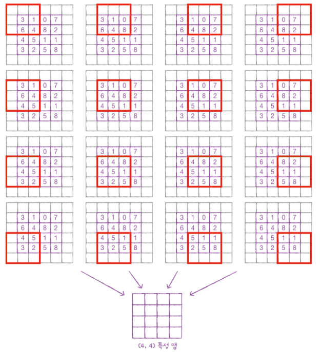

    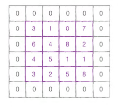
    ```
    패딩(padding)

    : 입력 배열의 주위를 가상의 원소로 채우는 것

    - 실제 입력값이 아니기 때문에 패딩은 0으로 채움
    
    -  패딩의 역할은 순전히 커널이 도장을 찍을 횟수를 늘려주는 것으로 실제 값은 0으로 채워져 있기 때문에 계산에 영향을 미치지는 않음 

    세임 패딩(same padding)

    : 이렇게 입력과 특성 맵의 크기를 동일하게 만들기 위해 입력 주위에 0으로 패딩 하는 것

    밸리드 패딩(valid padding)
    
    : 패딩 없이 순수한 입력 배열에서만 합성곱을 하여 특성 맵을 만드는 경우

    합성곱에서 패딩을 즐겨 사용하는 이유:

    - 만약 패딩 없이 합성곱을 한다면 위의 예에서 왼쪽 위 모서리의 3은 커널 도장에 딱 한 번만 찍힘
    
    - 이 입력을 이미지라고 생각하면 모서리에 있는 중요한 정보가 특성 맵으로 잘 전달되지 않을 가능성이 높고 반면 가운데 있는 정보는 두드러지게 표현됨
    ```
    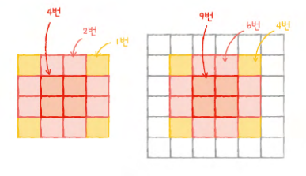

    ```
    스트라이드(stride)
    : 이동의 크기

    지금까지 본 합성곱 연산은 좌우, 위아래로 한 칸씩 이동했지만 두 칸씩 건너뛸 수도 있음
     -> 두 칸씩 이동하면 만들어지는 특성 맵의 크기는 더 작아짐
    ```
    ```
    풀링(Pooling)
    
    : 합성곱 층에서 만든 특성 맵의 가로세로 크기를 줄이는 역할을 수행
    
    - 특성 맵의 개수는 줄이지 않음
    
     ex. 예를 들면 아래 그림처럼 (2, 2, 3) 크기의 특성 맵에 풀링을 적용하면 마지막 차원인 개수는 그대로 유지하고 너비와 높이만 줄어들어 (1, 1,3) 크기의 특성 맵이 됨
    ```
    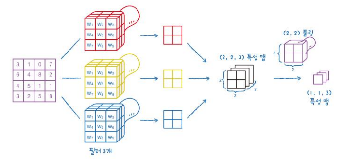

    ```
    풀링에는 가중치가 없고, 도장을 찍은 영역에서 가장 큰 값을 고르거나 평균값을 계산함
     -> 이를 각각 최대 풀링(max pooling)과 평균 풀링(average pooling)이라고 부름

    주의점:

    여기서 풀링은 두 칸씩 이동됨
    
    합성곱에서는 커널이 한 칸씩 이동했기 때문에 겹치는 부분이 있었지만 풀링에서는 겹치지 않고 이동함
    
    풀링의 크기가 (2, 2)이면 가로세로 두 칸씩 이동하고, (3,3) 풀링이면 가로세로 세 칸씩 이동함

    풀링을 사용하는 이유:
    
    합성곱에서 스트라이드를 크게 하여 특성 맵을 줄이는 것보다 풀링 층에서 크기를 줄이는 것이 경험적으로 더 나은 성능을 내기 때문
    ```
    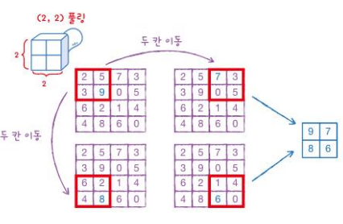

- **합성곱 신경망의 전체 구조**

    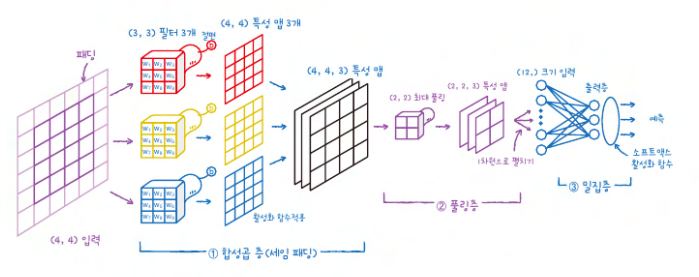

- **컬러 이미지를 사용한 합성곱**

    ```
    하나의 컬러 이미지는 너비와 높이 차원 외에 깊이 차원(또는 채널 차원)이 있음
    
    ex. 앞의 예제에서 입력이 (4, 4)가 아니라 (4, 4,3)이 됨. 이런 경우에는 어떻게 합성곱이 수행될까?

    - 깊이가 있는 입력에서 합성곱을 수행하기 위해서는 도장도 깊이가 필요함
     -> 즉 필터의 커널 크기가 (3, 3)이 아니라 (3, 3, 3)이 됨

    - 커널 배열의 깊이는 항상 입력의 깊이와 같음
    ```
    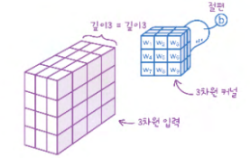
    ```
    이 합성곱의 계산은 (3, 3, 3) 영역에 해당하는 27개의 원소에 27개의 가중치를 곱하고 절편을 더하는 식이 됨
    ```
    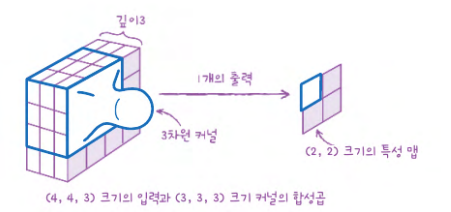
    ```
    입력이나 필터의 차원이 몇 개인지 상관없이 항상 출력은 하나의 값임
     -> 특성 맵에 있는 한 원소가 채워짐
    ```

- **확인 문제**

    ```
    1. 어떤 합성곱 층이 컬러 이미지에 대해 5개의 필터를 사용해 세임 패딩으로 합성곱을 수행합니다. 그다음 (2, 2) 풀링 층을 통과한 특성 맵의 크기가 (4, 4, 5)입니다. 이 경우 합성곱 층에 주입된 입력의 크기는 얼마일까요?

    ① (4, 4, 3)
    ② (4, 4, 5)
    ③ (8, 8, 3)
    ④ (8, 8, 5)

    답: 3️⃣
    ```

## 08-2 합성곱 신경망을 사용한 이미지 분류

> **핵심 키워드**: `Conv2D`, `MaxPooling2D`, `plot_model`

- **확인 문제**

    ```
    1. 합성곱 층의 필터가 입력 위를 이동하는 간격을 조절하는 Conv2D 클래스의 매개변수는 무엇인가요?

    ① kernel size
    ② strides
    ③ padding
    ④ activation

    정답: 2️⃣
    ```
    ```
    2. Conv2D 클래스의 padding 매개변수의 설명이 올바르게 된 것은 무엇인가요?
    
    ① 'valid'는 입력의 크기가 커널의 크기의 배수가 되도록 패딩 합니다.
    ② 'valid'는 입력과 출력의 가로세로 크기를 동일하게 만들도록 패딩 합니다.
    ③ 'same'은 입력의 크기가 커널의 크기의 배수가 되도록 패딩 합니다.
    ④ 'same'은 입력과 출력의 가로세로 크기를 동일하게 만들도록 패딩 합니다.

    정답: 2️⃣
    ```
    ```
    3. 다음 중 최대 풀링 층의 풀링 매개변수를 잘못 설정한 것은 무엇인가요?

    ① MaxPooling2D(2)
    ② MaxPooling2D((2, 2))
    ③ MaxPooling2D(2, 2)
    ④ MaxPooling2D((2, 2, 2))

    정답: 4️⃣
    ```


    


