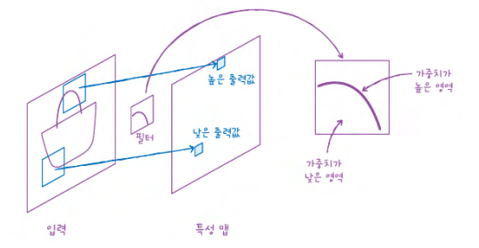
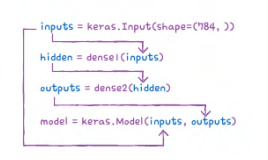
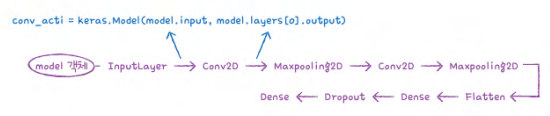
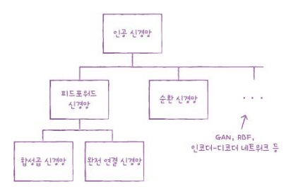
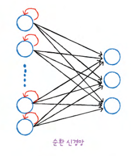
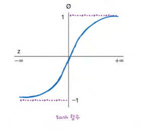
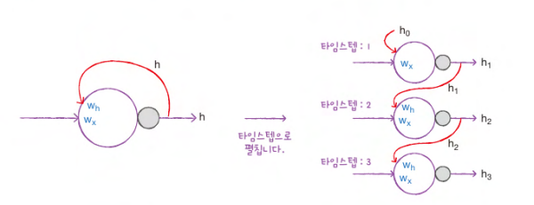
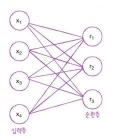
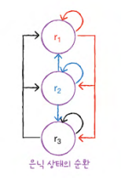

## 08-3 합성곱 신경망의 시각화

> **핵심 키워드**: `가중치 시각화`, `특성 맵 시각화`, `함수형 API`

- **가중치 시각화**

    ```
    합성곱 층은 여러 개의 필터를 사용해 이미지에서 특징을 학습

    각 필터는 커널이라 부르는 가중치와 절편을 가지고 있음

    - 절편은 시각적으로 의미가 있지 않음
    - 가중치는 입력 이미지의 2차원 영역에 적용되어 어떤 특징을 크게 두드러지게 표현하는 역할을 함
    ```
    

- **함수형 API**

    ```
    케라스 Sequential 클래스는 층을 차례대로 쌓은 모델을 만듦

    딥러닝에서는 좀 더 복잡한 모델이 많이 존재, 입략이 2개일 수도 있고 출력이 2개일 수도 있음

     -> 이런 경우 Sequential 클래스를 사용하기 어려워 대신 함수형 API(functional API)를 사용함
    ```
    ```python
    dense1 = keras.layers.Dense(100, activation='sigmoid')
    dense2 = keras.layers.Dense(10, activation='softmax')

    hidden = dense1(inputs)

    outputs = dense2(hidden)

    model = keras.Model(inputs, outputs)

    inputs = keras.Input(shape=(784,))
    ```
    

    ```
    model 객체의 층을 순서대로 나열하면 아래 사진과 같음

    여기서 우리가 필요한 것은 첫 번째 Conv2D의 출력임

    model 객체의 입력과 Conv2D의 출력을 알 수 있다면 이 둘을 연결하여 새로운 모델을 얻을 수 있음
    ```
    

- **확인 문제**

    ```
    2. 다음 중 케라스 모델을 만드는 올바른 방법이 아닌 것은 무엇인가요?
    
    ① model = Sequential()
    ② model = Model(ins, outs)
    ③ model = Model(inputs=ins, outputs=outs)
    ④ model = Model()(ins, outs)
    
    정답: 4️⃣
    ```
    ```
    3. 다음 중 Sequential 모델의 입력을 올바르게 참조하지 않는 것은 무엇인가요?
    
    ① model.layers[0].input
    ② model.layers[0].output
    ③ model._layers[0].input
    ④ model._layers[0].output
    
    정답: 2️⃣
    ```

## 09-1 순차 데이터와 순환 신경망

> **핵심 키워드**: `순차 데이터`, `순환 신경망`, `셀`, `은닉 상태`

- **순차 데이터**

    ```
    순차 데이터(sequential data)는 텍스트나 시계열 데이터(time series data)와 같이 순서에 의미가 있는 데이터를 의미

    댓글, 즉 텍스트 데이터는 단어의 순서가 중요한 순차 데이터

    완전 연결 신경망이나 합성곱 신경망은 이런 기억 장치가 없음
    
    하나의 샘플(또는 하나의 배치)을 사용하여 정방향 계산을 수행하고 나면 그 샘플은 버려지고 다음 샘플을 처리할 때 재사용하지 않음

    피드포워드 신경망(feedforward neural network, FFNN)는 이렇게 입력 데이터의 흐름이 앞으로만 전달되는 신경망을 말함

    이전에 처리했던 샘플을 다음 샘플을 처리하는데 재사용하기 위해서는 이렇게 데이터 흐름이 앞으로만 전달되어서는 안됨 
    
    다음 샘플을 위해서 이전 데이터가 신경망 층에 순환될 필요가 있음 
     -> 순환 신경망
    ```
    

- **순환 신경망**

    ```
    순환 신경망(recurrent neural network, RNN)

    완전 연결 신경망에 이전 데이터의 처리 흐름을 순환하는 고리 하나만 추가하면 됨

    아래 사진을 보면 뉴런의 출력이 다시 자기 자신으로 전달됨
     -> 즉 어떤 샘플을 처리할 때 바로 이전에 사용했던 데이터를 재사용함
    ```
    
    ```
    순환 신경망에서는 '이전 샘플에 대한 기억을 가지고 있다'고 종종 말해 이렇게 샘플을 처리하는 한 단계를 타임스텝(timestep)이라고 말함

    순환 신경망에서는 특별히 층을 셀cell이라고 부름
    
    한 셀에는 여러 개의 뉴런이 있지만 완전 연결 신경망과 달리 뉴런을 모두 표시하지 않고 하나의 셀로 층을 표현함
    
    또 셀의 출력을 은닉 상태hidden state라고 부름
    ```
    ```
    은닉층의 활성화 함수로는 하이퍼볼릭 탄젠트(hyperbolic tangent) 함수인 tanh2가 많이 사용됨

    tanh 함수는 시그모이드 함수와는 달리 -1~1 사이의 범위를 가짐
    ※ 시그모이드 함수는 0~1 사이의 범위를 가짐
    ```
    
    ```
    순환 신경망의 뉴런은 가중치가 하나 더 존재
     -> 이전 타임스템의 은닉 상태에 곱해지는 가중치
    
    셀은 입력과 이전 타임스텝의 은닉 상태를 사용하여 현재 타임스텝의 은닉 상태를 만듦
    ```
    
    
    타임스텝 1에서 셀의 출력 $h_1$이 타임스텝 2의 셀로 주입되고 이때 $w_h$와 곱해짐 
    
    마찬가지로 타임스텝 2에서 셀의 출력 $h_2$가 타임스텝 3의 셀로 주입되고 이때에도 $w_h$와 곱해짐

    여기에서 알 수 있는 것은 모든 타임스텝에서 사용되는 가중치는 $w_h$, 하나라는 점!
    -> 가중치는 타임스텝에 따라 변화되는 뉴런의 출력을 학습함

- **셀의 가중치와 입출력**

    ```
    ex. 순환층에 입력되는 특성의 개수가 4개이고 순환층의 뉴런이 3개라고 가정
    ```
    

    입력층과 순환층의 뉴런이 모두 완전 연결되기 때문에 가중치 $w_x$의 크기는 4 × 3 = 12개

    

    순환층에 있는 첫 번째 뉴런($r_1$)의 은닉 상태가 다음 타임스템에 재사용될 때 첫 번째 뉴런과 두 번째 뉴런, 세 번째 뉴런에 모두 전달됨(붉은색)
    
    두 번째 뉴런의 은닉 상태도 마찬가지로 첫 번째 뉴런과 두 번째 뉴런, 세 번째 뉴런에 모두 전달되고 (파란색), 세 번째 뉴런의 은닉 상태도 동일함(검은색)
    
    따라서 이 순환층에서 은닉 상태를 위한 가중치 $w_h$는 3 × 3 = 9개

    **모델 파라미터 수 = $w_x$ + $w_h$ + 절편 = 12 + 9 + 3 = 24**

- **확인 문제**

    ```
    1. 다음 중 순차 데이터로 처리하기 어려운 작업은 무엇인가요?

    ① 환자의 검사 결과를 바탕으로 질병 예측하기
    ② 월별 주택 가격을 바탕으로 다음 달의 주택 가격 예측하기
    ③ 태풍의 이동 경로를 바탕으로 다음 경로 예측하기
    ④ 노래 악보를 바탕으로 다음 음표를 예측하기

    정답: 1️⃣
    ```
    ```
    2. 순환 신경망에서 순환층을 부르는 다른 말과 순환층의 출력을 나타내는 용어를 올바르게 짝지은 것은 무엇인가요?

    ① 셀(shell)-셸 상태
    ② 셀(shell)-은닉 상태
    ③ 셀(cell)-셀 상태
    ④ 셀(cell)-은닉 상태

    정답: 4️⃣
    ```
    ```
    3. 순환 신경망에서 한 셀에 있는 뉴런의 개수가 10개입니다. 이 셀의 은닉 상태가 다음 타임스텝에 사용될 때 곱해지는 가중치 w의 크기는 얼마인가요?

    ① (10,)
    ② (10, 10)
    ③ (10, 10, 10)
    ④ 알 수 없음
    
    정답: 2️⃣
    ```

