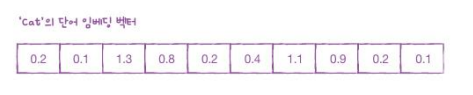
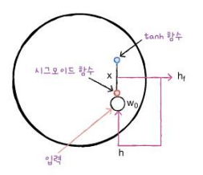
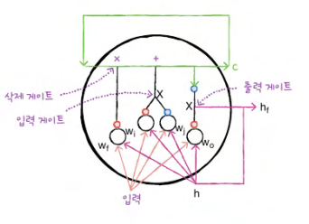
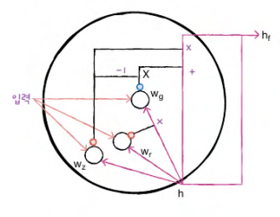

## 09-2 순환 신걍망으로 IMDM 리뷰 분류하기

> **핵심 키워드**: `말뭉치`, `토근`, `원-핫 인코딩`, `단어 임베딩`

- **IMDB 리뷰 데이터셋**
    ```
    토큰에 할당하는 정수 중에 몇 개는 특정한 용도로 예약되어 있음
    - 0: 패딩
    - 1: 문장의 시작
    - 2: 어휘 사전에 없는 토큰
    ```

- **단어 임베딩을 사용하기***

    ```
    단어 임베딩(word embedding)
    : 각 단어를 고정된 크기의 실수 벡터로 바꾸어 줌

    단어 임베딩으로 만들어진 벡터는 원 핫 인코딩된 벡터보다 훨씬 의미 있는 값으로 채워져 있기 때문에 자연어 처리에서 더 좋은 성능을 내는 경우가 많음
    ```
    

- **확인 문제**

    ```
    1. pad_sequences(5, padding='post', truncating='pre')로 했을 때 만들어질 수 없는 시퀀스는 무엇인가요?

    ① [10, 5, 7, 3, 8]
    ② [0, 0, 10, 5, 7]
    ③ [5, 7, 3, 8, 0]
    ④ [7, 3, 8, 0, 0]
    
    정답: 2️⃣
    ```
    ```
    2. 케라스에서 제공하는 가장 기본적인 순환층 클래스는 무엇인가요?
    
    ① RNN
    ② BaseRNN
    ③ PlainRNN
    ④ SimpleRNN

    정답: 4️⃣
    ```
    ```
    3. 어떤 순환층에 (100, 10) 크기의 입력이 주입됩니다. 이 순환층의 뉴런 개수는 16개입니다. 이 층에 필요한 모델 파라미터 개수는 몇 개인가요?

    ① 192
    ② 2416
    ③ 432
    ④ 1,872

    정답: 3️⃣
    ```

## 09-3 LSTM과 GRU 셀

> **핵심 키워드**: `LSTM`, `셀 상태`, `GRU`

- **LSTM 구조**

    ```
    LSTM은 Long Short-Term Memory의 약자
    : 말 그대로 단기 기억을 오래 기억하기 위해 고안됨

    은닉 상태를 만드는 방법:

    - 은닉 상태는 입력과 이전 타임스템의 은닉 상태를 가중치에 곱한 후 활성화 함수를 통과시켜 다음 은닉 상태를 만듦
    - 기본 순환층과는 다르게 시그모이드 활성화 함수를 사용
    - 또 tanh 활성화 함수를 통과한 어떤 값과 곱해져서 은닉 상태를 만듦
    ```
    

    ```
    LSTM에는 순환되는 상태가 2개로 은닉 상태 말고 셀 상태 cell state라고 부르는 값이 또 있음
    
    은닉 상태와 달리 셀 상태는 다음 층으로 전달되지 않고 LSTM 셀에서 순환만 되는 값임
    ```
    
    ```
    삭제 게이트
    : 셀 상태에 있는 정보를 제거하는 역할
    
    입력 게이트
    : 새로운 정보를 셀 상태에 추가
    
    출력 게이트
    : 여기를 통해서 이 셀 상태가 다음 은닉 상태로 출력됨
    ```

- **GRU 구조**

    ```
    GRU는 Gated Recurrent Unit의 약자

    이 셀은 LSTM을 간소화한 버전 LSTM처럼 셀 상태를 계산하지 않고 은닉 상태 하나만 포함하고 있음
    ```
    

- **확인 문제**

    ```
    1. 다음 중 텐서플로에서 제공하는 순환층 클래스가 아닌 것은 무엇인가요?

    ① SimpleRNN
    ② LSTM
    ③ GRU
    ④ Conv2D

    정답: 4️⃣
    ```
    ```
    2. LSTM 층에 있는 게이트가 아닌 것은 무엇인가요?
    
    ① 순환 게이트
    ② 삭제 게이트
    ③ 입력 게이트
    ④ 출력 게이트

    정답: 1️⃣
    ```
    ```
    3. 순환층을 2개 이상 쌓을 때 마지막 층을 제외하고는 모든 타임스템의 은닉 상태를 출력하기 위해 지정해야 할 매개변수는 무엇인가요?
    
    ① return_seq
    ② return_sequences
    ③ return_series
    ④ return hidden

    정답: 2️⃣
    ```